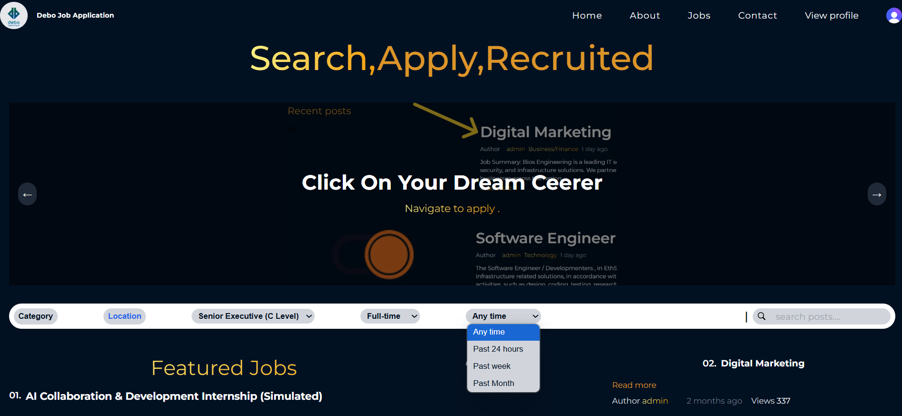

# DeboWork: Your AI-Powered Job Portal

## Overview
DeboWork is a comprehensive full-stack job application portal designed to streamline the job search and posting process. It empowers both job seekers to discover their dream roles and employers to efficiently post job openings. A key feature is its AI job summary assistant, which helps users quickly grasp job details, making the application process more informed and efficient.

## Features
- **Job Posting**: Employers can easily post various types of job vacancies.
- **Job Search & Discovery**: Job seekers can search and filter through a diverse range of job listings.
- **AI Job Summary Assistant**: Get concise, AI-generated summaries of job descriptions to quickly understand key requirements and responsibilities.
- **User Profiles**: Manage personal profiles, resumes, and application history.
- **Application Tracking**: Keep track of job applications.
- **Payment Integration**: (Implied by payment controllers/routes, for features like premium listings or subscriptions)
- **Webhook Integration**: (Implied by webhook controllers/routes, for real-time notifications or integrations)

## Homepage UI Screenshot
Here's a glimpse of the DeboWork homepage, showcasing its user-friendly interface:

*(Important: To display this image on GitHub, please create an `images` folder in the root of your repository and place your `debo_homePage.png` file inside it.)*

## Tech Stack

### Backend
- **Node.js**: JavaScript runtime environment.
- **Express.js**: Web application framework for Node.js.
- **MongoDB**: NoSQL database for flexible data storage.
- **Clerk**: (Likely used for authentication and user management, based on warnings during previous push attempts)
- **Other Libraries**: (e.g., Mongoose for MongoDB ODM, potentially Stripe for payments, etc.)

### Frontend
- **React.js**: JavaScript library for building user interfaces.
- **Vite**: Fast build tool and development server for modern web projects.
- **Tailwind CSS**: A utility-first CSS framework for rapid UI development.
- **Sass (SCSS)**: CSS preprocessor for more powerful styling.
- **Other Libraries**: (e.g., React Router for navigation, form libraries, etc.)

## Getting Started
Follow these steps to set up and run DeboWork on your local machine for development and testing purposes.

### Prerequisites
Make sure you have the following installed:
- Node.js (which includes npm)
- Git

### Installation
1. Clone the repository:
  ## Installation

### Install Backend Dependencies:
``bash
cd backend
cd frontend
npm install
# or yarn install

``.env Setup for backend
PORT=your port
CLERK_WEBHOOK_SECRET=your_clerk_webhook_secret_here
MONGODB_URL=your_mongodb_connection_string
MONGODB_URL2=your_second_mongodb_connection_string
CLERK_PUBLISHABLE_KEY=your_clerk_publishable_key
CLERK_SECRET_KEY=your_clerk_secret_key
CLIENT_URL=http://localhost:5173
BACKEND_URL=http://localhost:8800
IK__URL_ENDPOINT=your_imagekit_url_endpoint
IK__URL_PUBLIC_KEY=your_imagekit_public_key
IK__URL_PRIVATE_KEY=your_imagekit_private_key
GEMINI_API_KEY=your_gemini_api_key
SENDER_PASS=your_sender_email_password
SENDER_EMAIL=your_sender_email
EMAIL_SERVICE=gmail
DEBO_JOB=this just your email key for nodemailer
CHAPUBK_TEST=your_chapa_public_key
CHASECK_TEST=your_chapa_secret_key
CHAPA_BASE_URL=https://api.chapa.co/v1
CHAPA_WEBHOOK_HASH=your_chapa_webhook_hash
RECIPIENT_EMAILS=
``.env Setup for Frontend

VITE_IK_URL_ENDPOINT=your_ImageKit endpoint
VITE_IK_PUBLIC_KEY=your Imagekit public key
VITE_API_URL=your backend port
VITE_CLERK_PUBLISHABLE_KEY=your clerk publick key
VITE_GEMINI_API_KEY=your gemini api key

# Running the Application
Start the Backend Server:
From the backend directory:

bash
npm start

Start the Frontend Development Server:
From the frontend directory:

bash
npm run dev
# or npm start
The frontend application should open in your browser

# Usage
For Job Seekers:
Register/Login to create your profile

Browse job listings using the search bar and filters

Click on a job to view details and use the AI summary assistant

Apply for jobs with your profile and resume

For Employers:
Register/Login to your employer account

Navigate to the job posting section

Fill in job details and publish your opening

Contributing
Contributions are welcome! If you have suggestions or want to contribute, please follow these steps:

Fork the repository

Create a new branch (git checkout -b feature/your-feature-name)

Make your changes

Commit your changes (git commit -m 'Add new feature')

Push to the branch (git push origin feature/your-feature-name)

Open a Pull Request

License
This project is licensed under the MIT License - see the LICENSE.md file for details.

Contact
If you have any questions, feel free to reach out:
GitHub: mengistu3137

